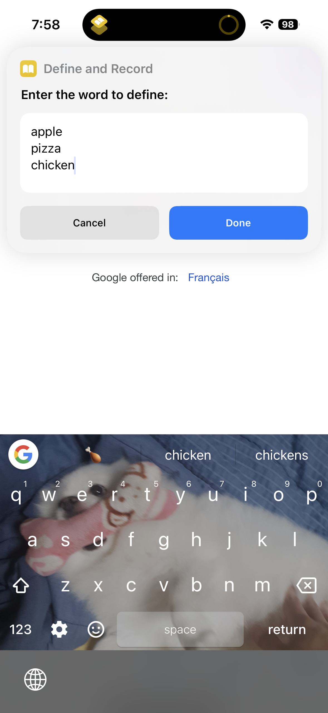
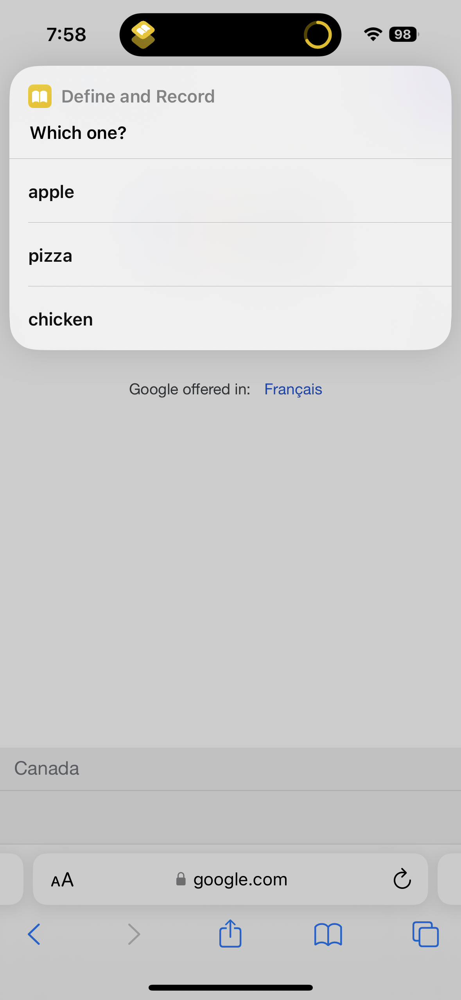
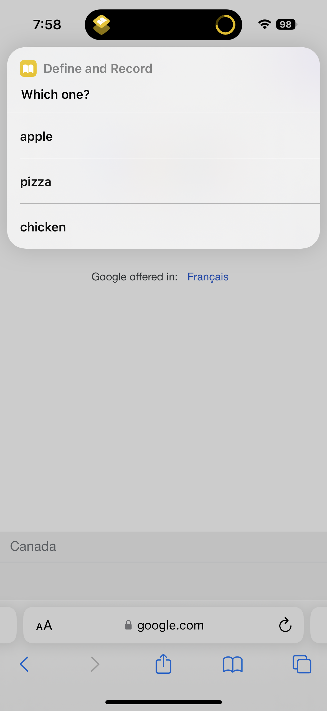
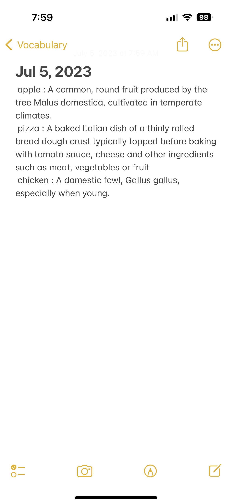

# ios_shortcuts

A collection of useful personal ios shortcuts.

Currently:
1. reminder url processor: cut url string in the ios reminder title and paste it in url section of the reminder.
	ex. Given a new reminder with title: "Best time to buy stock 2 - https://leetcode.com/problems/best-time-to-buy-and-sell-stock-ii/  for review!!!",
	the shortcut will change the title to "Best time to buy stock 2 - for review!!!" 
	and the reminder's url section will have https://leetcode.com/problems/best-time-to-buy-and-sell-stock-ii/

2. reminder due date updater for flagged: updates the due dates of past due incomplete flagged reminders to the current date. Imagine there are a few reminders associated with some tasks you tried to but couldn't finish today. If those tasks are huge/complex it could be hard to guess how long it will take you. In this case,  you might want to see them due "today" until you finish. For this use case, this shortcut will update the past due flagged reminders. This does not include flagged reminders without the due date set previously, since you might want to differentiate those flagged with due dates and those without the due dates. This reminder is especially useful once added to ios shortcuts' automation feature.
   	ex. Using automation, make the reminder run automatically at 12:01 AM daily.
   	Given incomplete reminder "Clean kitchen" with a flag and due date set to yesterday, shortcut will update its due date to today.
   	

4. define and record: 
	-  prompts for words separated by new lines and record the definition of each word using https://api.dictionaryapi.dev/api/v2/entries/en in the note in Vocabulary folder for the day, which is created if not exists.
	-  ask the user to select any of the words and show the definition using ios dictionary. It will loop back to selection stage after the user is done with the definition.
	
	

