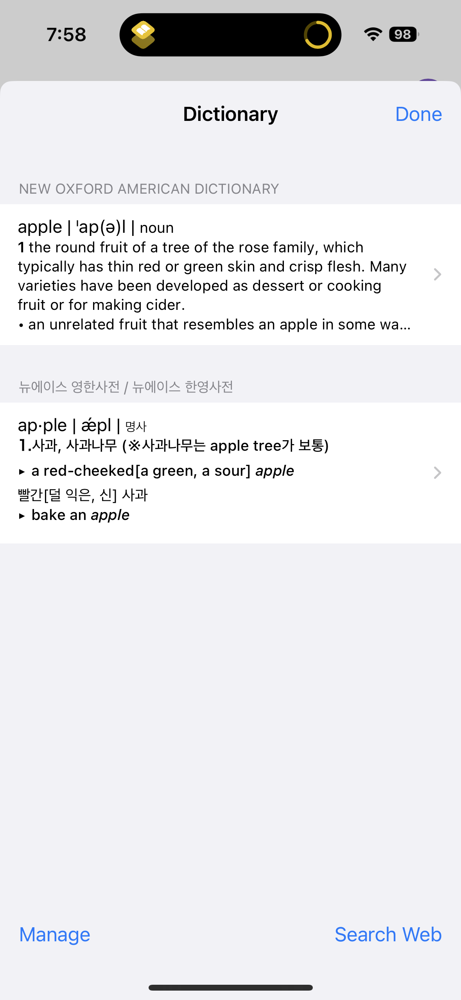

# ios_shortcuts

A collection of useful personal ios shortcuts.

Currently:
1. reminder url processor: cut url string in the ios reminder title and paste it in url section of the reminder.
	ex. Given a new reminder with title: "Best time to buy stock 2 - https://leetcode.com/problems/best-time-to-buy-and-sell-stock-ii/  for review!!!",
	the shortcut will change the title to "Best time to buy stock 2 - for review!!!" 
	and the reminder's url section will have https://leetcode.com/problems/best-time-to-buy-and-sell-stock-ii/

2. define and record: 
	-  prompts for words separated by new lines and record the definition of each word using https://api.dictionaryapi.dev/api/v2/entries/en in the note in Vocabulary folder for the day, which is created if not exists.
	-  ask the user to select any of the words and show the definition using ios dictionary. It will loop back to selection stage after the user is done with the definition.
	
	

